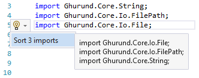

# Import Sorter
A Visual Studio extension for sorting C++ module imports

* Works for .ixx and .cpp files.
* Sorts imports in blocks.
* Doesn't sort single imports.
* Can sort imports inside a selection.
* Displays a preview.
